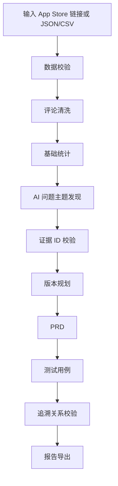

# App Review Insights Agent

一个基于 App Store 用户评论、运行时大模型语义分析和证据校验的产品洞察工具，可将用户评论转化为问题主题、版本规划、PRD、测试用例和完整追溯关系。

本项目是一个本地可运行 Demo，用于展示如何把真实或导入的用户评论加工成可解释、可追溯的产品分析结果。它不是正式生产系统，没有接入数据库、登录、权限、线上部署或模型训练。

## 1. 项目简介

### 解决什么问题

产品经理、用户研究人员和测试人员在阅读 App Store 评论时，经常遇到这些问题：

- 评论数量多，逐条阅读成本高。
- 英文评论和中英文混合评论会增加理解成本。
- 用户反馈分散，难以聚合成明确问题主题。
- PRD 和测试用例容易脱离原始用户证据。
- 直接使用通用大模型容易生成看似合理但缺少证据的结论。

本项目通过“确定性代码 + 大模型语义分析 + 程序化证据校验”的方式，把评论处理成一套可展示、可导出、可追溯的产品分析结果。

### 目标用户

- 产品经理：快速理解用户痛点，并形成版本规划和 PRD。
- 用户研究人员：聚合分散评论，保留原始证据。
- 测试人员：从 PRD 自动获得与需求关联的测试用例草案。
- 面试评审人员：验证候选人是否能把 AI 能力产品化，并控制模型幻觉。

### 为什么需要 AI

评论主题、用户问题总结、版本目标、PRD 表述和测试场景设计都属于语义任务。只靠固定关键词难以适配未知 App、未知评论集和临时变化的分析目标。因此项目在运行时调用 OpenAI-compatible API，让模型完成动态归纳和内容草拟。

但模型输出不会被直接信任。所有评论 ID、问题 ID、需求 ID、测试用例关联和证据数量都会经过代码校验。

### 最终输出

一次分析会输出：

- 基础统计结果
- AI 问题主题
- 版本规划
- PRD
- 测试用例
- 评论 → 问题 → 需求 → 测试用例追溯关系
- JSON 报告
- Markdown 报告

## 2. 核心功能

- App Store 评论采集：通过美国区 App Store 评论接口获取评论。
- JSON/CSV 文件导入：支持离线数据或评审方提供的数据集。
- 评论清洗与去重：过滤空评论、异常评分和重复评论。
- 基础统计：统计评分分布、低评分比例、平均评分、版本分布等。
- 用户自定义分析目标：支持输入目标或使用快捷目标按钮。
- 模型驱动的问题主题发现：从 1-2 星评论中动态归纳问题主题，并使用 4-5 星评论检查冲突反馈。
- 版本规划：基于已校验问题主题生成版本目标、优先级和规划理由。
- PRD 生成：生成结构化需求字段，并关联来源问题和评论。
- 测试用例生成：基于 PRD 生成正常、边界、异常和可用性测试用例。
- 追溯关系：展示评论 R-xxx → 问题 F-xxx → 需求 REQ-xxx → 测试用例 TC-xxx。
- 报告导出：支持完整 JSON 报告和 Markdown 报告。
- 缓存示例结果和异常兜底：API Key 缺失、模型失败或网络不稳定时，可查看缓存示例结果。

## 3. 完整处理流程



## 4. AI 和普通代码的职责分工

### 普通代码负责

- App ID 解析
- 数据获取
- JSON/CSV 解析
- 字段校验
- 去重
- 基础统计
- 稳定 ID 生成
- 证据 ID 校验
- `supportCount` 计算
- 追溯完整率计算
- 错误提示
- JSON/Markdown 报告导出

### 大模型负责

- 动态问题主题发现
- 问题总结
- 严重程度和置信度判断
- 版本规划内容生成
- PRD 内容生成
- 测试用例内容生成

### 关键原则

模型生成的评论 ID、问题 ID、需求 ID 和测试用例关联不能直接信任，必须经过程序校验。模型负责“草拟语义内容”，代码负责“判断哪些内容可以展示”。

## 5. 技术栈

当前项目真实使用：

- Next.js 15.5.7
- React 18.3.1
- TypeScript 5.6.3
- Node.js
- OpenAI SDK
- OpenAI-compatible API
- Zod
- Papa Parse
- Lucide React
- Vitest

## 6. 项目目录结构

```text
app-review-insights
├─ README.md
├─ package.json
├─ package-lock.json
├─ tsconfig.json
├─ next.config.ts
├─ next-env.d.ts
├─ sample_data/
│  ├─ reviews.json
│  └─ reviews.csv
├─ sample_outputs/
│  └─ example-analysis.json
├─ docs/
│  ├─ PRD.md
│  ├─ 需求文档.md
│  └─ 验收测试报告.md
└─ src/
   ├─ app/
   │  ├─ globals.css
   │  ├─ layout.tsx
   │  ├─ page.tsx
   │  └─ api/
   │     ├─ analyze/route.ts
   │     └─ sample-analysis/route.ts
   └─ lib/
      ├─ analysis-goal.ts
      ├─ traceability.ts
      ├─ ai/
      │  ├─ issue-discovery.ts
      │  ├─ product-planning.ts
      │  └─ test-generation.ts
      ├─ report/
      │  └─ export.ts
      └─ reviews/
         ├─ collector.ts
         ├─ cleaner.ts
         ├─ importer.ts
         ├─ pipeline.ts
         └─ types.ts
```

主要文件说明：

- `src/app/page.tsx`：主界面，包含输入、结果展示、示例兜底和导出。
- `src/app/api/analyze/route.ts`：主分析 API，串联采集、清洗、AI、PRD、测试和追溯。
- `src/app/api/sample-analysis/route.ts`：读取缓存示例结果。
- `src/lib/reviews/collector.ts`：App Store 评论采集。
- `src/lib/reviews/importer.ts`：JSON/CSV 导入解析。
- `src/lib/reviews/cleaner.ts`：评论清洗、去重和统计。
- `src/lib/ai/issue-discovery.ts`：AI 问题主题发现。
- `src/lib/ai/product-planning.ts`：版本规划和 PRD 生成。
- `src/lib/ai/test-generation.ts`：测试用例生成。
- `src/lib/traceability.ts`：完整证据链审计和追溯完整率计算。
- `src/lib/report/export.ts`：JSON/Markdown 报告导出。
- `sample_data/`：本地示例评论数据。
- `sample_outputs/`：缓存示例分析结果。

## 7. 环境要求

本项目在以下环境完成验证：

- Node.js：v24.18.0
- npm：11.16.0
- 操作系统：Windows 11
- 浏览器：Microsoft Edge / Chromium 系浏览器

建议使用 Node.js 20 或更高版本。项目依赖 Next.js 15、React 18 和 TypeScript 5，未配置特殊原生依赖，理论上可在 Windows、macOS 和 Linux 运行。

是否需要模型 API Key：

- 查看页面、导入数据、清洗统计、加载缓存示例结果：不需要。
- 实时 AI 问题发现、版本规划、PRD 和测试用例生成：需要 `OPENAI_API_KEY`。

## 8. 安装与启动

从 GitHub 克隆：

```bash
git clone https://github.com/BayesLee/app-review-insights.git
cd app-review-insights
npm install
npm run dev
```

Windows 复制环境变量模板：

```powershell
Copy-Item .env.example .env.local
```

macOS/Linux 复制环境变量模板：

```bash
cp .env.example .env.local
```

启动后访问：

```text
http://127.0.0.1:3000
```

也可以访问：

```text
http://localhost:3000
```

注意：标准启动方式是 `npm install` 和 `npm run dev`，不依赖仓库外部的本地脚本。

## 9. 环境变量配置

`.env.example` 提供模板，真实配置放在 `.env.local`：

```text
OPENAI_API_KEY=your_api_key_here
OPENAI_BASE_URL=
OPENAI_MODEL=gpt-4o-mini
MAX_REVIEW_PAGES=4
```

变量说明：

- `OPENAI_API_KEY`：必填，仅实时模型分析需要。不要提交到 GitHub。
- `OPENAI_BASE_URL`：选填。使用 OpenAI 官方接口时可留空；使用兼容接口、代理或其他提供商时填写对应 base URL。
- `OPENAI_MODEL`：选填。默认使用 `gpt-4o-mini`，也可以换成兼容接口支持的模型名。
- `MAX_REVIEW_PAGES`：选填。控制 App Store 评论最多采集页数，接口层最多允许 10 页。

修改 `.env.local` 后需要重启开发服务。

## 10. 三种使用方式

### 输入 App Store 链接

在左侧输入美国区 App Store 链接，例如：

```text
https://apps.apple.com/us/app/workout-for-women-home-gym/id839285684
```

然后填写分析目标并点击 `开始分析`。

### 上传 JSON

支持字段：

```json
[
  {
    "id": "optional-id",
    "rating": 1,
    "title": "review title",
    "content": "review content",
    "author": "user",
    "date": "2026-07-01",
    "version": "1.2.0"
  }
]
```

### 上传 CSV

CSV 表头：

```csv
id,rating,title,content,author,date,version
```

使用说明：

- App Store 链接和文件上传二选一。
- `rating` 必须是 1-5。
- `content` 为空的数据会在清洗阶段删除并计入清洗报告。
- `id` 缺失时，程序会生成稳定的导入来源 ID，后续模型分析前再统一生成 `R-xxx`。
- `title`、`author`、`date`、`version` 可以缺失，系统会使用兜底值。

## 11. 页面操作流程

1. 选择数据来源：App Store 链接、JSON 文件、CSV 文件或示例数据。
2. 填写分析目标，也可以点击快捷目标按钮。
3. 点击 `开始分析`。
4. 查看基础统计，包括原始评论数、清洗后评论数、平均评分、证据充分度和数据来源。
5. 查看 AI 问题主题，包括严重程度、置信度、支持评论和冲突评论。
6. 查看版本规划，包括版本名称、目标、优先级、包含问题和规划理由。
7. 查看 PRD，包括用户问题、解决方案、范围、非范围、验收标准、风险和来源证据。
8. 查看测试用例，包括步骤、预期结果、类型、优先级和来源证据。
9. 查看追溯关系，按需求展开 `评论 → 问题 → 需求 → 测试用例`。
10. 导出 JSON 或 Markdown 报告。

## 12. 缓存示例结果

示例文件位置：

- `sample_data/reviews.json`
- `sample_data/reviews.csv`
- `sample_outputs/example-analysis.json`

使用场景：

- 没有配置 API Key。
- 模型接口失败。
- App Store 网络请求失败。
- 面试现场需要快速展示完整结果形态。

页面会明确标注：

```text
示例缓存结果，不是本次实时模型输出。
```

缓存结果不会伪装成实时 AI 输出。

## 13. 幻觉控制与证据校验

### reviewId 如何生成

模型分析前，程序会对当前清洗后的评论按顺序生成稳定的 `R-001`、`R-002`、`R-003`。这些 ID 只在本次分析结果中使用，便于追溯。

### 模型输出如何解析

每个 AI 阶段都要求模型返回严格 JSON。服务端使用 `JSON.parse` 和 Zod schema 校验结构。

### 非法 JSON 如何处理

如果模型返回非法 JSON 或结构不符合要求，当前阶段返回 `error`，页面显示明确错误，不展示伪造结果。

### 虚构 ID 如何处理

- 虚构 `reviewId`：从主题、PRD 或测试用例证据中删除。
- 虚构 `issueId`：从版本规划、PRD 和测试用例中删除。
- 虚构 `requirementId`：对应测试用例被过滤。
- 无有效证据的主题、需求或测试用例不会展示。

### supportCount 为什么由代码计算

模型可能返回错误数量，因此 `supportCount` 只根据通过校验的 `supportingReviewIds` 计算，不相信模型生成的数量。

### 追溯完整率如何计算

追溯完整率由代码计算：

```text
具有有效评论、问题、需求和测试用例映射的需求数 / 总需求数
```

## 14. 测试方法

```bash
npm run typecheck
npm test
npm run build
npm run dev
```

命令说明：

- `npm run typecheck`：执行 TypeScript 类型检查。
- `npm test`：执行 Vitest 自动化测试。
- `npm run build`：执行 Next.js 生产构建。
- `npm run dev`：启动本地开发服务。

最近一次本地验证结果：

- 自动化测试文件数量：6
- 自动化测试数量：32
- `typecheck`：通过
- `test`：通过
- `build`：通过

详细验收记录见 `docs/验收测试报告.md`。

## 15. 面试现场 Demo 流程

建议 5-8 分钟演示：

1. 项目背景：说明这是评论到产品文档的本地 Demo。
2. 输入示例数据：点击 `加载示例数据`，或上传 `sample_data/reviews.json`。
3. 设置分析目标：例如选择 `订阅与付费`。
4. 展示 AI 问题发现：讲清低评分评论和高评分冲突评论的选择逻辑。
5. 展示版本规划和 PRD：说明需求如何绑定来源问题和评论。
6. 展示测试用例：说明高优先级需求至少覆盖正常流程和异常/边界流程。
7. 展示追溯关系：展开需求卡片，查看评论原文和完整链路。
8. 展示导出：导出 Markdown 或 JSON 报告。
9. 演示无 API Key 或缓存兜底：点击 `查看示例分析结果`，强调这是缓存输出，不是实时模型结果。

## 16. 当前限制

- App Store 稳定接口可能存在字段限制或网络不稳定。
- App Store 评论版本号可能无法可靠获取。
- 模型效果依赖模型能力、Prompt 稳定性和接口配置。
- 当前是本地 Demo，未接数据库。
- 未部署线上服务。
- 未做用户登录和权限系统。
- 未做大规模性能测试。
- 未实现人工编辑确认、历史记录和多 App 对比。
- 缓存示例结果只用于兜底演示，不代表实时模型调用成功。

## 17. 安全说明

- `.env` 和 `.env.local` 已加入 `.gitignore`，不得提交。
- 模型调用在服务端 API 路由中完成。
- `OPENAI_API_KEY` 不会发送到浏览器。
- 导出报告不包含 API Key 或环境变量值。
- 示例缓存结果不包含真实密钥。
