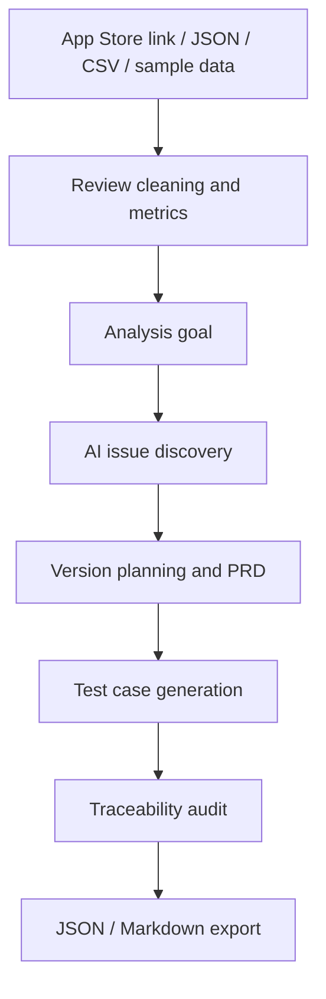

# App Review Insights Agent

App Review Insights Agent is a local Next.js application that turns real or imported App Store reviews into evidence-backed product planning artifacts.

It helps a product or AI Agent interviewer see the complete workflow:

1. Collect or import user reviews.
2. Clean and deduplicate review data.
3. Use an analysis goal to constrain the work.
4. Discover user issue themes with an OpenAI-compatible model.
5. Generate version planning and PRD requirements.
6. Generate structured test cases.
7. Validate the traceability chain from review evidence to tests.
8. Export a JSON or Markdown report.

## Workflow



## Tech Stack

- Next.js 15 App Router
- React 18
- TypeScript
- Zod for model and request validation
- Vitest for automated tests
- OpenAI SDK for OpenAI-compatible chat completion APIs
- Papa Parse for CSV import
- Lucide React for UI icons

## Environment Variables

Copy `.env.example` to `.env.local`:

```text
OPENAI_API_KEY=your_api_key_here
OPENAI_BASE_URL=
OPENAI_MODEL=gpt-4o-mini
MAX_REVIEW_PAGES=4
```

`OPENAI_BASE_URL` is optional. Use it only for an OpenAI-compatible provider or proxy.

Secrets must stay local. The repository ignores `.env`, `.env.local`, `.env.*.local`, `node_modules`, `.next`, coverage output, and build artifacts.

## Install and Run

```bash
npm install
npm run dev
```

Then open:

```text
http://127.0.0.1:3000
```

## Three Ways to Use

### 1. App Store Link

Paste a U.S. App Store link, for example:

```text
https://apps.apple.com/us/app/workout-for-women-home-gym/id839285684
```

The app uses Apple's public iTunes `userReviewsRow` JSON endpoint with the U.S. storefront header. Collection is capped by `MAX_REVIEW_PAGES` and at most 10 pages.

### 2. JSON Import

Upload a JSON file shaped like:

```json
[
  {
    "id": "optional-id",
    "rating": 1,
    "title": "review title",
    "content": "review content",
    "author": "user",
    "date": "2026-07-01",
    "version": "1.2.0"
  }
]
```

If `id` is missing, code creates a stable imported source id. Ratings must be 1-5. Empty review content is removed during cleaning and counted in the cleaning report.

### 3. CSV Import

Upload a CSV file with this header:

```csv
id,rating,title,content,author,date,version
```

Imported JSON and CSV reviews reuse the same cleaning, AI analysis, PRD, test generation, traceability, and export pipeline as App Store reviews.

## Sample Data and Demo Fallback

The repo includes:

- `sample_data/reviews.json`
- `sample_outputs/example-analysis.json`

The UI provides:

- `加载示例数据`: runs the real pipeline on local sample reviews.
- `查看示例分析结果`: loads a cached complete report when API keys, network, or model calls are unavailable.

Cached output is explicitly marked:

```text
示例缓存结果，不是本次实时模型输出。
```

The sample data includes low-rating problem reviews, high-rating conflicting reviews, duplicates, mixed Chinese/English text, and multiple app versions.

## Where AI Participates

AI participates at runtime in three semantic steps:

1. Dynamic issue discovery from 1-2 star reviews, with up to 20 high-rating reviews as conflict candidates.
2. Version planning and PRD generation from validated issue themes.
3. Test case generation from validated PRD requirements.

These model calls happen on the server. The API key is never sent to the browser.

## Rules vs Model Responsibility

Rule-based code handles deterministic and safety-critical work:

- App Store collection and import parsing
- Rating validation
- Empty-content filtering
- Duplicate review removal
- Stable `R-xxx`, `F-xxx`, `REQ-xxx`, `VP-xxx`, and `TC-xxx` assignment
- Model JSON parsing
- ID validation
- Support counts
- Traceability metrics
- JSON and Markdown export

The model handles semantic drafting:

- Discovering issue theme names and summaries
- Writing version objectives and PRD content
- Designing specific test scenarios from requirements and acceptance criteria

## Evidence Chain and Hallucination Control

The app validates every model-produced relationship before display:

- `supportingReviewIds` must exist in current cleaned 1-2 star reviews.
- `conflictingReviewIds` must exist in selected 4-5 star conflict candidates.
- `sourceIssueIds` in PRD must exist in current validated themes.
- `sourceReviewIds` in PRD must come from those themes' validated supporting reviews.
- Test `requirementId` must exist in the current PRD.
- Test `sourceIssueIds` and `sourceReviewIds` must come from the referenced requirement.
- Requirements without evidence or acceptance criteria are filtered.
- Test cases without concrete steps or expected results are filtered.
- Generic test templates such as "进入页面，验证功能是否正常" are filtered.
- Warnings are shown instead of being silently hidden.

The traceability audit calculates:

```text
requirements with valid review -> issue -> requirement -> test case mapping / total requirements
```

The UI displays overall counts for valid reviews, issue themes, requirements, test cases, and traceability rate.

## Export Reports

After analysis, the UI can export:

- Complete JSON report
- Markdown report

Reports include data source, analysis time, analysis goal, basic metrics, model names, issue themes, version plans, PRD, test cases, complete traceability chain, warnings, and current limitations.

Reports do not include API keys or environment variables.

## Tests

```bash
npm run typecheck
npm test
npm run build
```

Automated tests cover issue discovery, version planning, PRD validation, test case generation, JSON/CSV import, cleaning behavior, traceability rate, invalid JSON handling, missing API keys, and cached sample marking.

## Current Limitations

- The App Store public review endpoint can be unavailable or rate-limited; JSON/CSV import and sample data are provided as fallback paths.
- The stable App Store review source does not reliably return app version metadata, so App Store version analysis is limited. Imported data can include `version`.
- Model-generated content quality depends on the configured provider and model.
- The app is intentionally local-only for this homework submission: no database, login, background jobs, hosted deployment, LangChain, or multi-agent orchestration.
- Cached sample output is for demo fallback only and is not a substitute for real-time model analysis.

## Interview Demo Steps

1. Run `npm install` and `npm run dev`.
2. Open `http://127.0.0.1:3000`.
3. Enter an App Store link, or upload a JSON/CSV file.
4. Pick or type an analysis goal.
5. Click `开始分析`.
6. Walk through the result areas in order: basic metrics, AI issue themes, version planning, PRD, test cases, traceability, export.
7. Explain that model output is treated as a draft and code validates every ID before display.
8. Export the Markdown report for a human-readable submission artifact.
9. If the model or network is unavailable, click `查看示例分析结果` and point out the cached-result warning banner.
