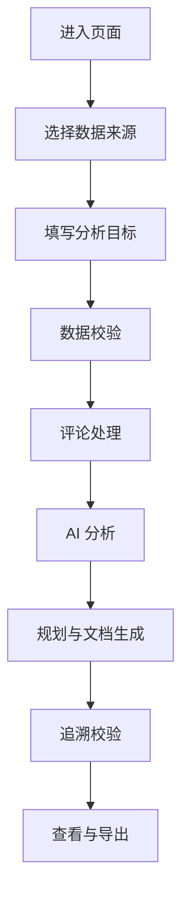

# App Review Insights Agent PRD

## 1. 产品概述

- 产品名称：App Review Insights Agent
- 产品定位：本地可运行的 App Store 评论产品洞察 Demo
- 目标用户：产品经理、用户研究人员、测试人员、面试评审人员
- 核心价值：将杂乱用户评论转化为可追溯的问题主题、版本规划、PRD 和测试用例
- 当前版本范围：支持 App Store 评论采集、JSON/CSV 导入、AI 主题发现、版本规划、PRD、测试用例、追溯审计、示例缓存和报告导出

本产品不是生产系统，不包含数据库、登录、权限、部署、模型训练和多 Agent 编排。

## 2. 用户问题

- 用户反馈处理效率低：大量评论需要人工逐条阅读和归类。
- 人工分类主观：不同人员对同一批评论可能得出不同主题。
- 需求缺乏原始证据：PRD 中的需求经常难以追溯到具体评论。
- 产品和测试文档割裂：测试用例不一定覆盖真实用户问题。
- 通用大模型可能生成无依据结论：如果没有程序校验，模型可能虚构 ID、主题或需求。

## 3. 产品目标

- 将杂乱评论转为结构化问题主题。
- 让主要结论都能追溯到评论原文。
- 支持未知 App 和未知评论数据。
- 支持用户自定义分析目标。
- 在模型失败时保持页面可用。
- 生成可供产品和测试继续编辑的文档草案。
- 通过规则校验降低模型幻觉风险。

## 4. 产品范围

### In Scope

- App Store 链接输入。
- JSON/CSV 评论文件上传。
- 示例数据加载。
- 评论清洗、去重和基础统计。
- 分析目标输入和快捷目标按钮。
- 服务端 OpenAI-compatible API 调用。
- AI 问题主题发现。
- 版本规划和 PRD 生成。
- 测试用例生成。
- 证据 ID 校验。
- 追溯完整率计算。
- JSON/Markdown 报告导出。
- 缓存示例结果展示。

### Out of Scope

- 自动修改 App。
- 自动发布版本。
- 模型训练或微调。
- 登录、权限和团队协作。
- 数据库存储。
- 历史任务列表。
- 在线部署服务。
- 多 App 长期监控。
- 多 Agent 工作流。
- LangChain 编排。

## 5. 用户流程



## 6. 页面信息架构

- 数据输入区：App Store 链接、JSON/CSV 上传、加载示例数据、当前数据来源。
- 分析目标区：目标输入框、默认目标说明、快捷目标按钮。
- 流程状态区：评论获取、数据清洗、AI 主题分析、版本规划与 PRD、测试用例生成、证据链校验、完成。
- 基础统计区：原始评论、清洗后评论、平均评分、证据充分度、数据来源。
- AI 问题主题区：模型名称、输入评论数、1-2 星评论、冲突候选评论、主题卡片和证据评论。
- 版本规划区：版本名称、目标、优先级、包含问题、规划理由。
- PRD 区：需求 ID、标题、用户问题、解决方案、范围、验收标准、风险、来源问题和评论原文。
- 测试用例区：测试 ID、需求 ID、类型、优先级、步骤、预期结果和证据关联。
- 追溯关系区：按需求展开评论原文和完整链路。
- 导出区：JSON 报告和 Markdown 报告导出按钮。
- 错误提示区：展示链接、文件、模型和证据不足等错误。

## 7. 详细功能设计

### 7.1 数据来源选择

- 功能说明：用户选择 App Store 链接或文件上传。
- 用户操作：输入链接、上传 JSON/CSV，或点击加载示例数据。
- 系统行为：二选一校验，文件上传后清空链接输入。
- 页面展示：显示当前数据来源。
- 状态变化：未选择时待运行；选择后可开始分析。
- 异常提示：同时选择或都未选择时提示用户二选一。
- 验收标准：数据来源显示准确，错误选择不白屏。

### 7.2 评论获取与导入

- 功能说明：从 App Store 或本地文件获得评论。
- 用户操作：点击开始分析。
- 系统行为：App Store 调用评论接口；JSON/CSV 解析文件内容；示例数据读取本地文件。
- 页面展示：采集数量、来源、采集时间。
- 状态变化：评论获取从待运行变为完成或异常。
- 异常提示：链接错误、网络失败、JSON/CSV 格式错误。
- 验收标准：三种来源都能进入清洗流程。

### 7.3 评论清洗

- 功能说明：清洗异常评论。
- 用户操作：无需额外操作。
- 系统行为：过滤空内容、异常评分、重复评论。
- 页面展示：原始条数、有效条数、重复评论、异常评论。
- 状态变化：清洗完成后基础统计可展示。
- 异常提示：无有效评论时展示空状态。
- 验收标准：清洗报告准确反映过滤结果。

### 7.4 基础统计

- 功能说明：提供确定性统计结果。
- 用户操作：查看基础统计区。
- 系统行为：计算平均评分、低评分比例、评分分布和版本分布。
- 页面展示：指标卡片、评分条、版本标签。
- 状态变化：清洗后刷新。
- 异常提示：版本缺失时说明数据限制。
- 验收标准：统计不依赖模型。

### 7.5 分析目标

- 功能说明：约束模型分析范围。
- 用户操作：输入文本或点击快捷目标。
- 系统行为：空目标使用默认目标，并写入模型 Prompt。
- 页面展示：结果区显示本次分析目标。
- 状态变化：每次分析使用当前目标。
- 异常提示：空目标不报错。
- 验收标准：不同目标会生成不同 Prompt 内容。

### 7.6 AI 问题主题

- 功能说明：动态识别用户问题主题。
- 用户操作：点击开始分析。
- 系统行为：选取全部 1-2 星评论和最多 20 条 4-5 星冲突候选评论，服务端调用模型。
- 页面展示：主题、总结、严重程度、置信度、支持评论、冲突评论。
- 状态变化：成功、跳过或异常。
- 异常提示：API Key 缺失、模型失败、非法 JSON。
- 验收标准：无有效证据主题不展示。

### 7.7 版本规划

- 功能说明：从有效主题生成版本计划。
- 用户操作：查看版本规划区。
- 系统行为：模型草拟内容，代码生成 `VP-xxx` 并校验 `includedIssueIds`。
- 页面展示：版本名称、目标、优先级、问题和理由。
- 状态变化：主题成功后运行。
- 异常提示：主题失败或无主题时跳过。
- 验收标准：版本规划只引用当前有效主题。

### 7.8 PRD 生成

- 功能说明：从有效主题生成结构化产品需求。
- 用户操作：查看 PRD 区。
- 系统行为：模型草拟，代码生成 `REQ-xxx`，过滤无证据或无验收标准需求。
- 页面展示：标题、背景、用户问题、目标、方案、范围、验收标准、风险和来源评论。
- 状态变化：版本规划阶段成功后展示。
- 异常提示：证据不足时显示提示。
- 验收标准：每条需求可追溯到有效评论。

### 7.9 测试用例生成

- 功能说明：从 PRD 生成测试用例。
- 用户操作：查看测试用例区。
- 系统行为：模型生成候选用例，代码生成 `TC-xxx` 并校验关联。
- 页面展示：标题、需求 ID、测试类型、步骤、预期结果、来源 ID。
- 状态变化：PRD 有有效需求后运行。
- 异常提示：空需求、非法 JSON、虚构 ID、空步骤。
- 验收标准：高优先级需求至少有正常流程和异常/边界用例。

### 7.10 追溯关系

- 功能说明：验证评论、问题、需求和测试用例是否完整映射。
- 用户操作：展开需求卡片查看。
- 系统行为：按需求生成追溯路径和完整率。
- 页面展示：统计指标、完整率、原始评论正文和链路。
- 状态变化：测试生成后计算。
- 异常提示：无效关联显示 warning。
- 验收标准：完整率由代码计算，不由模型生成。

### 7.11 报告导出

- 功能说明：导出 JSON 和 Markdown 报告。
- 用户操作：点击导出按钮。
- 系统行为：从当前结果对象生成文件下载。
- 页面展示：两个导出按钮。
- 状态变化：分析结果存在时可用。
- 异常提示：无结果时不显示按钮。
- 验收标准：导出内容完整且不包含 API Key。

### 7.12 示例缓存

- 功能说明：提供无 API Key 或模型失败时的兜底演示。
- 用户操作：点击查看示例分析结果。
- 系统行为：读取 `sample_outputs/example-analysis.json`。
- 页面展示：完整缓存结果和提示横幅。
- 状态变化：当前结果替换为缓存结果。
- 异常提示：缓存文件读取失败时显示错误。
- 验收标准：缓存结果明确标注不是实时模型输出。

## 8. AI 工作流设计

### Prompt 输入

每个模型阶段都会接收：

- 本次分析目标。
- 已由代码整理过的输入 JSON。
- 严格输出 JSON 结构要求。
- 不得虚构 ID 的约束。
- 证据不足时可以少输出或不输出的说明。

### 评论样本选择

- 低评分评论：全部 1-2 星评论。
- 高评分冲突评论：最多 20 条 4-5 星评论。
- 其他评分：参与基础统计，但不作为主题支持证据。

### 分析目标注入

用户输入或默认目标会进入 Prompt 的说明行和 JSON payload 字段 `analysisGoal`。

### JSON 输出与解析

模型必须返回 JSON。服务端先 `JSON.parse`，再用 Zod schema 校验结构。

### ID 校验

- 主题阶段校验 `supportingReviewIds` 和 `conflictingReviewIds`。
- 规划/PRD 阶段校验 `includedIssueIds`、`sourceIssueIds` 和 `sourceReviewIds`。
- 测试阶段校验 `requirementId`、`sourceIssueIds` 和 `sourceReviewIds`。

### 后续生成条件

- AI 主题发现失败：不调用 PRD 生成。
- PRD 无有效需求：不调用测试用例生成。
- 测试用例生成后：执行追溯审计。

## 9. 数据结构

### Review

```ts
type CleanedReview = {
  id: string;
  title: string;
  body: string;
  rating: number;
  version: string;
  updatedAt: string;
  author: string;
  country: "us";
  appId: string;
  page: number;
  sourceUrl: string;
  normalizedText: string;
  bodyLength: number;
};
```

### Scope

```ts
type ScopeSummary = {
  goal: string;
  appId: string;
  storefront: "us";
  maxPages: number;
  dataSource: DataSourceSummary;
  focusAreas: string[];
  evidenceLevel: "充足" | "一般" | "不足";
  notes: string[];
};
```

### IssueTheme

```ts
type IssueTheme = {
  issueId: string;
  title: string;
  summary: string;
  severity: "high" | "medium" | "low";
  confidence: "high" | "medium" | "low";
  supportingReviewIds: string[];
  conflictingReviewIds: string[];
  supportCount: number;
  supportingReviews: ReviewEvidence[];
  conflictingReviews: ReviewEvidence[];
};
```

### VersionPlan

```ts
type VersionPlan = {
  versionPlanId: string;
  versionName: string;
  objective: string;
  priority: "high" | "medium" | "low";
  includedIssueIds: string[];
  rationale: string;
};
```

### Requirement

```ts
type ProductRequirement = {
  requirementId: string;
  title: string;
  background: string;
  userProblem: string;
  productGoal: string;
  proposedSolution: string;
  inScope: string[];
  outOfScope: string[];
  acceptanceCriteria: string[];
  priority: "high" | "medium" | "low";
  risks: string[];
  sourceIssueIds: string[];
  sourceReviewIds: string[];
  sourceReviews: ReviewEvidence[];
  traceability: Array<{ reviewId: string; issueId: string; requirementId: string }>;
};
```

### TestCase

```ts
type GeneratedTestCase = {
  testCaseId: string;
  title: string;
  requirementId: string;
  sourceIssueIds: string[];
  sourceReviewIds: string[];
  priority: "high" | "medium" | "low";
  preconditions: string[];
  steps: string[];
  expectedResult: string;
  testType: "functional" | "boundary" | "exception" | "usability";
  status: "generated";
};
```

### Traceability

```ts
type TraceabilityResult = {
  status: "complete" | "incomplete";
  metrics: {
    validReviewCount: number;
    issueThemeCount: number;
    requirementCount: number;
    testCaseCount: number;
    completeRequirementCount: number;
    traceabilityRate: number;
  };
  requirements: RequirementTraceability[];
  warnings: string[];
};
```

### ExportReport

导出报告由 `buildJsonReport` 生成，包含：

- `generatedAt`
- `sampleNotice`
- `isSampleOutput`
- `dataSource`
- `analysisGoal`
- `metrics`
- `cleaning`
- `aiModels`
- `issueThemes`
- `versionPlans`
- `requirements`
- `testCases`
- `traceability`
- `warnings`
- `limitations`

## 10. 版本规划规则

- 版本规划从已校验问题主题生成。
- 优先级参考严重程度、证据数量、用户目标和对核心体验的影响。
- `rationale` 用于解释为什么某问题被放入该版本，方便人工评审。
- 没有有效问题时跳过版本规划。
- 当前 `versionName` 是规划标签，例如 `V1.1`，不代表真实 App 已发布版本。
- `versionPlanId` 由代码生成，模型不能决定最终 ID。

## 11. PRD 生成规则

每条需求包含：

- `requirementId`：代码生成。
- `title`：需求标题。
- `background`：证据背景。
- `userProblem`：用户问题。
- `productGoal`：产品目标。
- `proposedSolution`：建议方案。
- `inScope`：范围内。
- `outOfScope`：非范围。
- `acceptanceCriteria`：验收标准，不能为空。
- `priority`：优先级。
- `risks`：风险。
- `sourceIssueIds`：来源问题。
- `sourceReviewIds`：来源评论。

无有效问题、无有效评论或无验收标准的需求不会展示。

## 12. 测试用例规则

测试类型：

- `functional`：正常流程。
- `boundary`：边界流程。
- `exception`：异常流程。
- `usability`：可用性测试。

规则：

- `testCaseId` 由代码生成。
- `requirementId` 必须来自当前有效 PRD。
- `sourceIssueIds` 必须来自对应需求。
- `sourceReviewIds` 必须来自对应需求。
- `steps` 和 `expectedResult` 不能为空。
- 禁止生成空泛模板，例如“进入页面，验证功能是否正常”。
- 每个高优先级需求至少需要 1 条正常流程用例和 1 条异常或边界用例。

## 13. 证据追溯设计

页面展示完整链路：

```text
评论 R-xxx
→ 问题 F-xxx
→ 需求 REQ-xxx
→ 测试用例 TC-xxx
```

每条链路展示评论原文，而不只是 ID。

追溯完整率：

```text
具有有效评论、问题、需求和测试用例映射的需求数 / 总需求数
```

如果某个需求缺少测试用例、缺少评论、引用不存在问题，系统会显示 warning。

## 14. 错误提示设计

- 链接错误：提示输入有效 App Store 链接或上传文件。
- 文件格式错误：提示 JSON 或 CSV 无法解析。
- rating 非法：在清洗报告和 warning 中提示。
- 评论为空：在清洗报告和 warning 中提示。
- API Key 缺失：提示配置 `OPENAI_API_KEY` 并重启服务。
- 模型失败：显示模型请求失败或返回内容异常。
- 非法 JSON：显示模型返回非法 JSON。
- 无有效证据：提示证据不足，不生成后续内容。
- 报告导出失败：当前导出基于浏览器 Blob，未分析时不展示按钮。

## 15. 安全设计

- 模型调用在服务端 API 路由完成。
- API Key 从 `.env.local` 读取，不传给浏览器。
- `.env` 和 `.env.local` 不提交。
- 导出报告只包含分析结果，不包含环境变量。
- 缓存示例结果不包含真实密钥。

## 16. 埋点与效果评估建议

当前项目尚未实现真实埋点。后续可考虑记录：

- 分析成功率。
- 模型 JSON 解析成功率。
- 无效证据 ID 比例。
- 追溯完整率。
- 平均分析耗时。
- 文件导入失败率。
- 用户导出率。

以上指标是后续建议，不代表当前已经采集。

## 17. 后续迭代建议

以下能力规划中，尚未实现：

- 长评论分批聚合。
- 多模型效果对比。
- 人工编辑和确认需求。
- 历史分析记录。
- 多 App 对比。
- 在线部署。
- 用户反馈闭环。
- 更完善的异常输入可视化。
